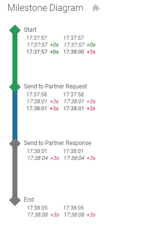
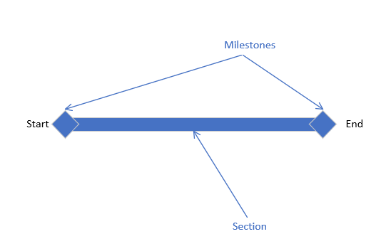
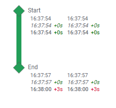
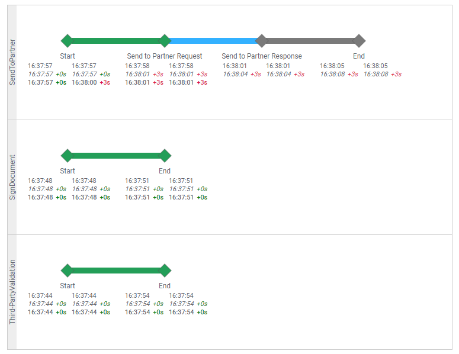
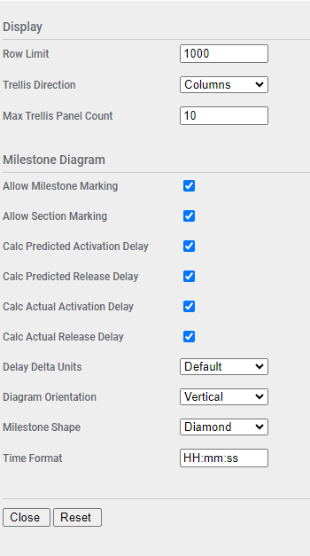

# Milestone Diagram Mod for Spotfire®

The Milestone Diagram Mod is a graphical representation of points of interest in a process flow or state model. It includes optional planned, predicted, and actual times for activation and release for each milestone step. It has application in business activity monitoring and process tracking use cases.

## Try this mod in Spotfire® Analyst

### How to open the mod
1. Open Spotfire® Analyst, and create an analysis by loading some data.
1. Unzip the downloaded file, and locate the .mod file in the unzipped folder. 
1. Drag the file into the analysis. 
1. The visualization mod is added to the analysis.
1. To learn about the capabilities and limitations of this visualization mod, keep reading.

For general information on how to use and share visualization mods, [read the Spotfire documentation](https://docs.tibco.com/pub/sfire-analyst/14.1.0/doc/html/en-US/TIB_sfire-analyst_UsersGuide/index.htm#t=modvis%2Fmodvis_how_to_use_a_visualization_mod.htm).

## Data requirements

Every mod handles missing, corrupted and/or inconsistent data in different ways. It is advised to always review how the data is visualized.

The Milestone Diagram Mod will render a graphical representation of provided milestones and sections. These terms are defined as:

* **Milestone** - a state or point of interest in a flow, often where dependencies may be attached. In general, a flow will consist of at least two milestones, typically named Start and End, but they may be called anything. There could be additional milestones present.

* **Section** - the connection between two sequential milestones in a flow. In general, a flow will consist one section for each milestone pair. If there are N milestones, there will be N - 1 sections. 

Here is a graphical representation of what this looks like:

This Mod will only handle a set of milestones in series. That is, they may not exist in parallel. Each milestone is joined to its subsequent milestone by a single section.

To display the diagram, all data must exist in a single table, and each object must exist in a single row. This mod supports two rendering modes:

* **Both Milestones and Sections are provided** - at a minimum there must be two milestone rows, and a single section row
* **Only Milestones are provided** - at a minimum there must be two milestone rows

When milestones are rendered, optionally three different times of two different types may be displayed. 

The two types relate to how milestones are used in dependencies in larger process flows. 

* **Activation Time** - this represents the time the milestone starts. In process terms, the first inbound dependency becomes satisfied.
* **Release Time** - this represents the time the milestone completes. In process terms, all inbound dependencies become satisfied and processing is passed to the next step.

The three times represent values calcualted at different phases of process flow execution.

* **Planned** - expected times when a process is first created
* **Predicted** - estimated times as a process progresses and schedules are recalculated
* **Actual** - actual times when a process hits the point being displayed, in this case when a milestone is actually Activated or Released

## Setting up the Milestone Diagram

The mod supports data provided as two different methods:

- Milestones and Sections (section-based sequencing)
- Milestones only (milestone-based sequencing)

The section-based sequencing model requires additional rows, but allows the linking bar between milestones to be colored and marked separately. 

If both milestones and sections are provided (section-based sequencing), the minimum data required is shown  in this sample data set: 

| objectType | milestoneId | sequence | displayName | initialMilestoneId | terminalMilestoneId |
| ---------- | ----------- | -------- | ----------- | ------------------ | ------------------- |
| Milestone  | myStartId   |          | Start       |                    |                     |
| Milestone  | myEndId     |          | End         |                    |                     |
| Section    |             | 1        |             | myStartId          | myEndId             |

Here there are a minimum of 3 rows, two milestone rows and 1 section row. The row type is identified by the **objectType** column. The values in this column _must_ be **Milestone** or **Section**. Any other values will cause the row to be ignored. 

The unique identifier for the milestones is **milestoneId** and each milestone must have a unique milestoneId within the scope of data passed into a Milestone Diagram Mod instance. This is ignored for section rows.

The unique identifier for the section is **sequence** and each section must have a unique sequence within the scope of data passed into a Milestone Diagram Mod instance. The sequence must be an integer and should increase as required. This will be used to determine the order of display of the milestones and sections. This is ignored for milestone rows.

The **displayName** column applies to the displayed name for each milestone row. This is ignored for section rows.

The **initialMilestoneId** and **terminalMilestoneId** apply to section rows, and indicate the initial and terminal milestones for the section and must refer to values in milestoneId for provided milestone rows. These are ignored for milestone rows.

Additional optional fields are supported when configuring the mod properties.

If only milestones are provided (milestone-based sequencing), the minimum data required is shown in this sample data set:

| objectType | milestoneId | sequence | displayName | 
| ---------- | ----------- | -------- | ----------- | 
| Milestone  | myStartId   | 1        | Start       | 
| Milestone  | myEndId     | 2        | End         | 

Here there are a minimum of 2 rows, both milestone rows. The value for **objectType** is still required, but may be hard-coded to the value of "Milestone" rather than refer to a column.

Values for **milestoneId** and **displayName** are as above. Value for **sequence** must now define the order of milestones rather than order of sections. The fields **initialMilestoneId** and **terminalMilestoneId** are not required.

Specify the data table with marking and filters as usual. The diagram supports marking data; you can set the **Marking** property as desired.

The mod includes the follow axes. Not all axis values are mandatory and will be indicated.

### Object Type
Mandatory. Must contain "Milestone" or "Section" identifying each row as the respective object. Any other values will cause the row to be ignored. If only milestones are provided, this may be hard-coded to the value of "Milestone" rather than refer to a column.

### Display Name
Mandatory for milestones, ignored for sections. This will be the name rendered.

### Trellis By
Optional. If set, then data will be grouped and trellised.

### Milestone ID
Mandatory for milestones, ignored for sections. This the unique identifier for milestones.

### Planned Activation and Planned Release
Optional, applies to milestones, ignored for sections. These represent the activation time and release times for a given milestone and must be DateTime values.

### Predicted Activation and Predicted Release
Optional, applies to milestones, ignored for sections. These represent the predicted activation time and release times for a given milestone and must be DateTime values. The mod will automatically calculate and display the time delta from the planned times, if configured.

### Actual Activation and Actual Release
Optional, applies to milestones, ignored for sections. These represent the actual activation time and release times for a given milestone and must be DateTime values. The mod will automatically calculate and display the time delta from the planned times, if configured.

### Sequence
If sections are provided then this is mandatory for sections, ignored for milestones. This is the unique identifier for sections. If sections are not provided then this is mandatory for milestones. In both cases the sequence defines the order that milestones are displayed.

### Initial Milestone ID and Terminal Milestone ID
Mandatory for sections, ignored for milestones. This indicates the milestone ID of the initial and terminal milestones in a section.

### Color
Optional. This will determine the color applied against milestone and section graphical elements. If section rows are not provided, then the section graphical elements will be colored the same as the following milestone.

At this point the diagram should render. 

## Configuring the Milestone Diagram

Additional configuration for the mod can be accessed by clicking on the small settings icon in the upper right corner of the visualization area. This will display the configuration properties over the visualization. Maximize the visualization if necessary to update the fields. The configuration panel will only be accessible when the analysis is in Editing mode. 

| Property | Description | Remarks |
| -------- | ----------- | ------- |
| Row Limit | Maximum number of rows to render | If the row count is exceeded then an error message will be displayed. This is a safety feature to keep from accidentally rendering too much data. |
| Trellis Direction | Direction for trellis panels | Columns or Rows |
| Max Trellis Panel Count | Maximum number of trellis panels to render | If the panel count is exceeded then an error message will be displayed. This is a safety feature to keep from accidentally rendering too much data. |
| Allow Milestone Marking | Allows milestones to be marked | This setting with the next one allow you to selectively mark certain process objects, if necessary. |
| Allow Section Marking | Allows sections to be marked |  |
| Calc Predicted Activation Delay | Calculate predicted activation delay | |
| Calc Predicted Release Delay | Calculate predicted release delay | |
| Calc Actual Activation Delay | Calculate actual activation delay | |
| Calc Actual Release Delay | Calculate actual release delay | |
| Delay Delta Units | Units to calculate time deltas for Predicted and Actual times |  default, seconds, minutes, hours, or days. If default is selected, then the most appropriate unit will be selected based on the size of the delay.  |
| Diagram Orientation | Diagram orientation | Horizontal or Vertical |
| Milestone Shape | Milestone shape | Circle, Diamond, Donut, or Square |
| Time Format | Time formatting to apply | Format string similar to Java SimpleDateFormat (H hours, m mins, s secs) | 

To return to the visualization click the Close button. Settings are applied immediately.

## Using the Milestone Diagram

Once the mod is configured it will render a diagram of milestones and sections in the correct sequence. 

Each milestone will have a block of times associated with it.

 - The left column is Activated times
 - The right column is Release times

Within each column there can be planned, predicted, and/or actual times, depending on configuration. All times are optional.

 - The first time is the planned activation or release time
 - The second time is the predicted activation or release time. This will be rendered in italic.
 - The third time is the actual arrival or departure time. This will be rendered in bold.

For predicted and actual times a delay delta is displayed by default and is calculated based on the configured **Delta Units** configuration value. If there are no planned times then the delay delta will not be present. Delays can be hidden using the additional configuration panel.

The mod supports marking of rows if configured. When both milestones and sections are provided (section-based sequencing), click a milestone or section to mark it. When only milestones are provided (milestone-based sequencing), click a milestone to mark it, and the preceding section. Clicking sections in this case has no effect. 

Use CTRL-Click to add additional rows to the marking, or remove an already marked row. To clear the marking, click in any open area. You can selectively disable marking particular object types in the mod configuration.

## Building the Project

In a terminal window:
- `npm install`
- `npm start`

In a new terminal window:
- `npm run server`

## More information about Spotfire® Mods

- [Spotfire® Visualization Mods on the Spotfire® Community Exchange](https://community.spotfire.com/files/category/7-visualization-mods/): A safe and trusted place to discover ready-to-use Mods
- [Spotfire® Mods Developer Documentation](https://spotfiresoftware.github.io/spotfire-mods/docs/): Introduction and tutorials for Mods Developers
- [Mods by Spotfire®](https://github.com/spotfiresoftware/spotfire-mods/releases/latest): A public repository for example projects

© Copyright 2024. Cloud Software Group, Inc.